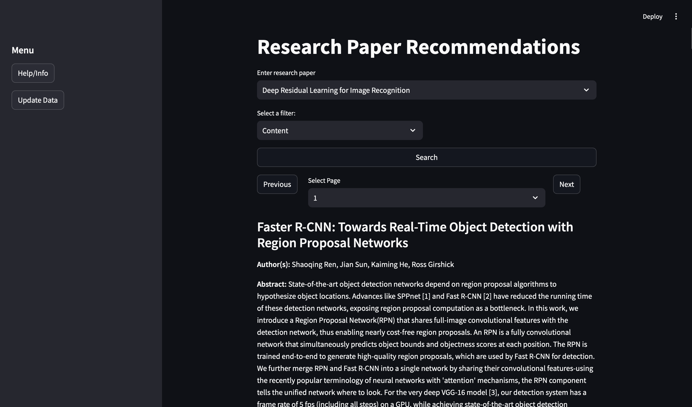

# Research Paper Recommender System

This project is a **content-based research paper recommender system** that helps users discover relevant research papers based on the content of abstracts. The system is built using **web-scraped data** from research papers and applies **NLP techniques** for text preprocessing, vectorization, and similarity ranking. The project includes three components: `vectorize.py` (for NLP and content similarity), `webscrape.py` (for scraping research paper data), and `website.py` (a front-end interface built with Streamlit).

## Table of Contents

- [Overview](#overview)
- [File Descriptions](#file-descriptions)
- [Web Scraping](#web-scraping)
- [Content-based Recommender](#content-based-recommender)
- [Streamlit Application](#streamlit-application)
- [Installation](#installation)
- [License](#license)

---

## Overview

The **Research Paper Recommender System** scrapes research paper metadata (title, authors, abstract, year, etc.) from IEEE Xplore and creates a content-based recommendation engine using **Natural Language Processing (NLP)**. The goal is to provide users with research papers that are most similar to a given input query abstract.

The recommendation engine ranks papers based on **cosine similarity** of their vectorized abstract content, and the front-end is powered by a **Streamlit web app** for an intuitive user experience.

<br>



*Figure 1: A screenshot of the website.*

## File Descriptions
### Modeling:
   -  **vectorize.py**:
      - Preprocesses text using tokenization, lemmatization, and removing stop words.
      - Vectorizes text using pre-trained `SentenceTransformer` embeddings.
      - Ranks abstracts based on cosine similarity.
### Webscraping:
   - **webscrape.py**:
      - Uses Selenium and BeautifulSoup to scrape research paper metadata from IEEE Xplore.
      - Extracts titles, authors, year, conference/journal names, and abstracts.
      - Saves the scraped data in a CSV file.
   - **publications.csv**:
      - CSV file conatining webscraped data

### front_end:
   - **website.py**:
      - Streamlit web interface where users can input a query and receive paper recommendations.
      - Allows filtering by author, year, and publisher.

## Web Scraping
The webscrape.py file uses Selenium to automate the retrieval of research papers from IEEE Xplore. It scrapes the following data for each paper:
- Title
- Authors
- Year
- Conference/Journal name
- Paper type (Conference Paper, Journal Article, etc.)
- Publisher
- Abstract
All scraped data is saved in a publications.csv file for later use in the recommendation engine.

## Content-based Recommender
The recommender system uses a content-based filtering approach by analyzing the text of research paper abstracts. The workflow includes:
1. Preprocessing: Abstracts are tokenized, stop words are removed, and text is lemmatized.
2. Vectorization: Abstracts are converted into dense vectors using pre-trained SentenceTransformer models.
3. Similarity Calculation: Cosine similarity is used to find papers most similar to the query abstract.
4. Ranking: Research papers are ranked based on their similarity scores.

## Streamlit Application
The website.py file creates a Streamlit app where users can:
- Search for research papers by title.
- Filter results based on author, year, or publisher.
- View research paper metadata (title, authors, abstract, etc.).
### Interface
- Search Query: Select a research paper from the drop-down menu.
- Filters: Filter by content, author, year, or publisher.
- Pages: Navigate through search results with pagination.


## Installation

1. Clone the repository:

   ```bash
   git clone https://github.com/rkhera04/Book-Recommendations.git
   ```
2. Install the required dependencies:
   ```bash
   pip install -r requirements.txt
   ```
4. Run the Streamlit app
   ```bash
   streamlit run front_end/main.py
   ```

## License
This project is licensed under the MIT License. See the [LICENSE](LICENSE) file for details.
